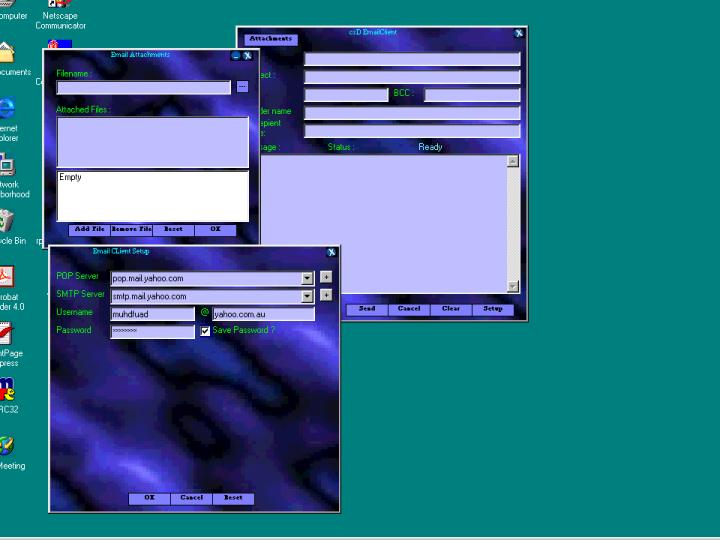



## csD Email Client \( SMTP \)

### Description

This is an email client that use the Simple Mail Transfer Protocol.Can be used with many SMTP servers ( Haven't found any server that didn't works well yet ).Able to include attachments with Email.Can authenticate with POP server first.Use MS WInsock Control TCP/IP connection.
 
### More Info
 
It used SMTP protocol as described in RFC 821. There may be any updates which still not applied.

There is no SSL or TLS implementation, so currently the username and password are sent without any protection, so make sure you are in a secured network environment before trying this code.This client program are made to demonstrate the SMTP protocol.If you find any bugs, please email me.Vote if you want to,I greatly appreciated.Also if any of you know how to implement SSL/TLS, can you tell me how ?

There is no implementation of timeout controls yet.There is only a simple timer at the beginning of the connection.The code may be not optimized for performance.

             |
---                |---
**Submitted On**   |2001-08-07 10:22:38
**By**             |[dReaMgRaZeR](https://github.com/Planet-Source-Code/PSCIndex/blob/master/ByAuthor/dreamgrazer.md)
**Level**          |Intermediate
**User Rating**    |3.9 (39 globes from 10 users)
**Compatibility**  |VB 6\.0
**Category**       |[Internet/ HTML](https://github.com/Planet-Source-Code/PSCIndex/blob/master/ByCategory/internet-html__1-34.md)
**World**          |[Visual Basic](https://github.com/Planet-Source-Code/PSCIndex/blob/master/ByWorld/visual-basic.md)
**Archive File**   |[csD Email 24194862001\.zip](https://github.com/Planet-Source-Code/dreamgrazer-csd-email-client-smtp__1-25919/archive/master.zip)

